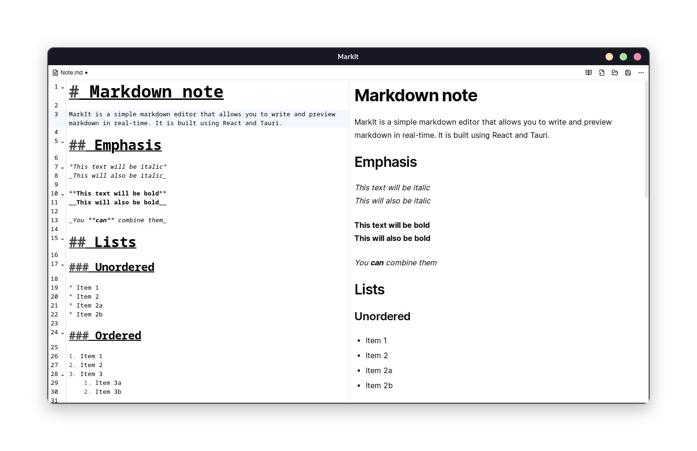

# MarkIt



MarkIt is a simple markdown editor that allows you to write and preview markdown in real-time. It is built using React and Tauri.

## Developing and building

This should work on all operating systems. Including Windows, macOS and Linux

### Installing building dependencies

Make sure you have Node.js and Rust installed and follow [this instruction](https://tauri.app/v1/guides/getting-started/prerequisites) to install Tauri building dependencies

### Developing

```bash
pnpm dev
```

### Building

```bash
pnpm build
```

The built executable should be in `src-tauri/target/release`

## License

This project is licensed under the MIT license. See the [LICENSE](LICENSE) file for more information.
